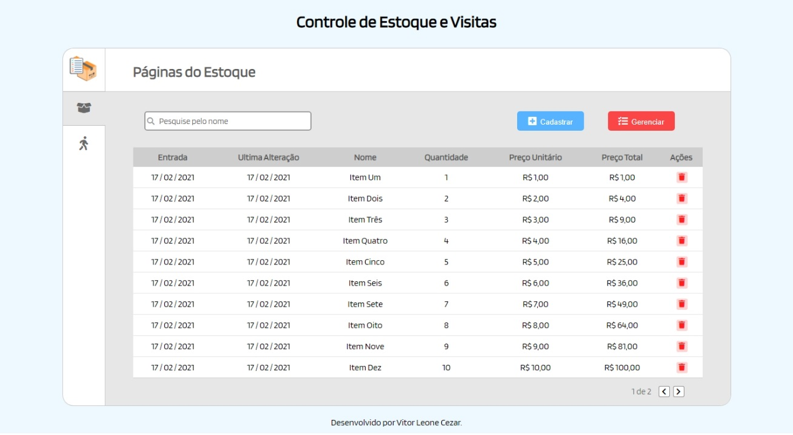
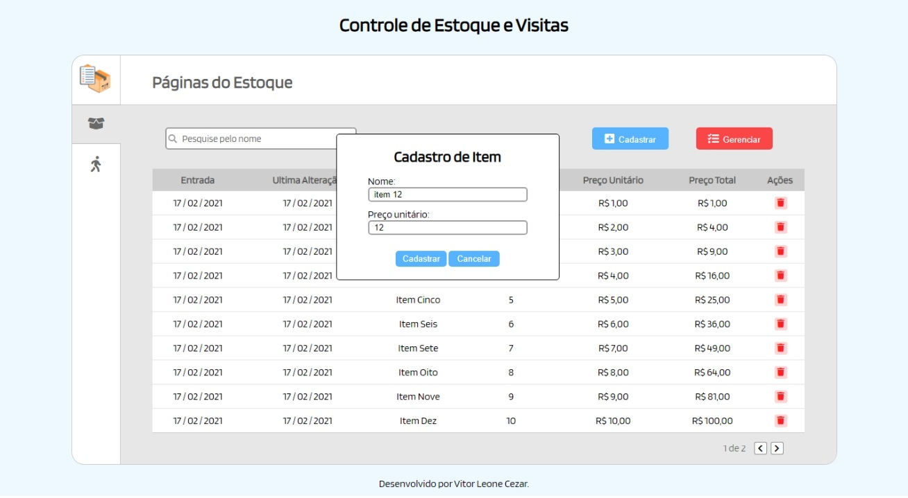
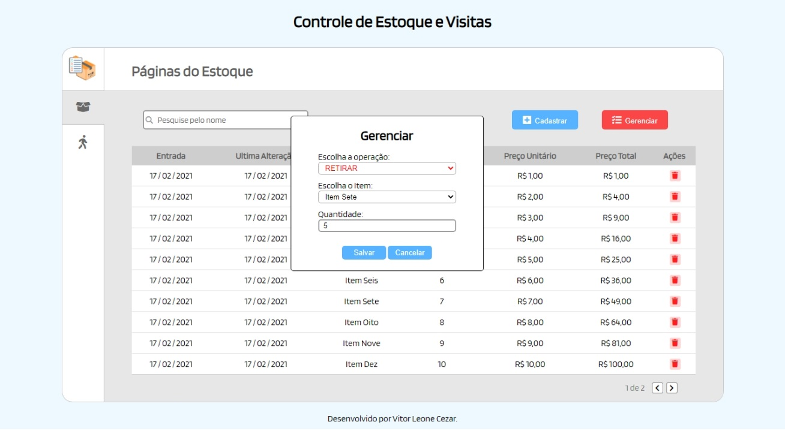
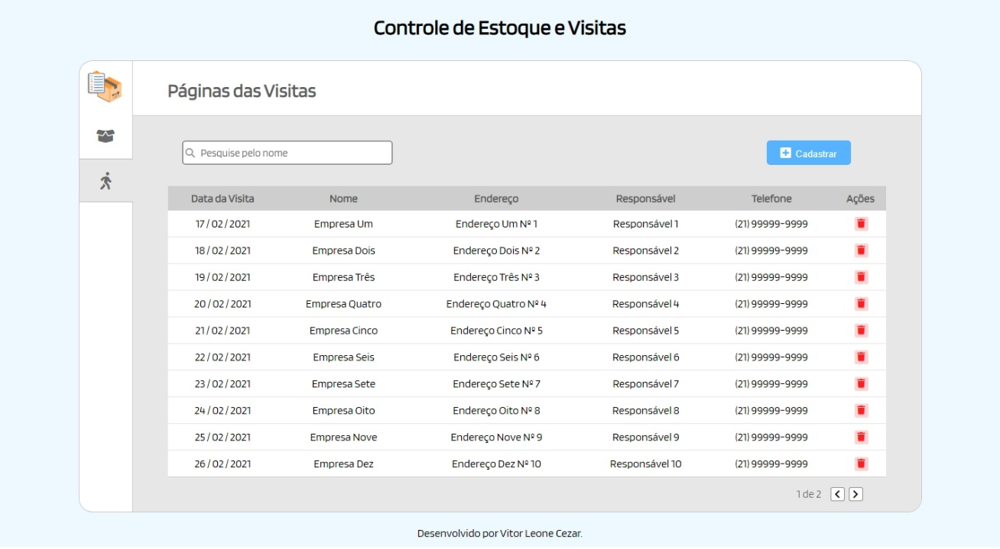
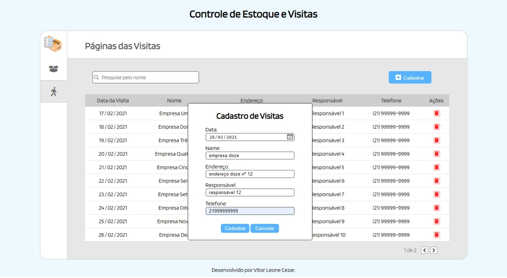

# 💻 CONTROLE DE ESTOQUE E VISITAS

---

## 🗒️ Sobre o projeto

Uma aplicação de gerenciamento de estoque e visitas. Na aplicação existe um menu lateral onde se pode navegar pelas opções de estoque e visitas, ambas as opções exibem uma lista de itens e tem paginação com limite de 10 itens por página.

No estoque é possível cadastrar itens com nome e preço unitário. É possível gerenciar os itens cadastrados através das operações de adicionar e retirar itens.
A operação 'adicionar' exibe itens já cadastrados onde é possível acrescentar a quantidade do item selecionado. O mesmo acontece na operação 'retirar', tirando o fato que será usada para retirar itens e exibirá somente itens cadastrados e com quantidade maior que '0'.

Já nas visitas, pode-se adicionar itens na lista com informações como data da visita, nome da empresa, endereço e nome do responsável.

Todos os itens de ambas as opções podem ser deletados clicando na lixeira da coluna "ações".

As informações são adicionadas no localStorage, sendo assim persistindo mesmo que a pagina seja fechada ou recarregada.

Link para teste: https://vleonecezar.github.io/controle-estoque-visita/

---

## 🛠 Tecnologias

### Frontend:

-   HTML
-   CSS
-   JavaScript

---

## 🎨 Screens

### Estoque

  

  

  

### Visitas

  

  

